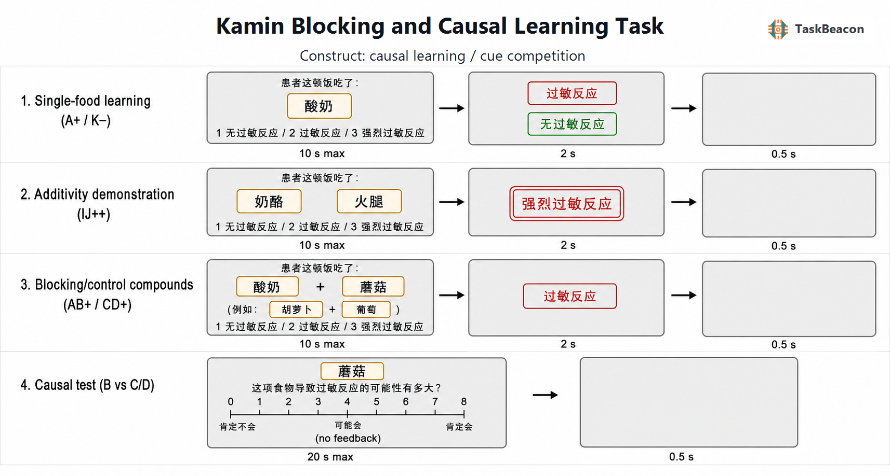

# Kamin Blocking and Causal Learning Task

| Field | Value |
|---|---|
| Name | Kamin Blocking and Causal Learning Task |
| Task ID | T000086 |
| Version | 0.1.0 |
| Date Updated | 2026-08-01 |
| PsyFlow Version | Current local runtime |
| PsychoPy Version | Current local runtime |
| Modality | Behavioral |
| Language | Chinese |
| Variant | Additive forward blocking |

## 1. Task Overview

This task measures cue competition in human causal learning. Participants learn which foods cause an allergic reaction in a hypothetical patient. Pretraining demonstrates that two independently causal foods can produce a stronger outcome. In the critical forward-blocking sequence, cue A first predicts allergy (`A+`) and is then paired with a novel cue B while the same allergy occurs (`AB+`). A novel compound (`CD+`) provides the within-subject control. Lower causal ratings for B than for C/D indicate blocking.

Primary outputs are prediction accuracy and response time during learning, the 0–8 rating for blocked cue B, the mean control rating for C/D, and the blocking score `mean(C,D) − B`.

## 2. Task Flow



### Block-Level Flow

1. Additivity pretraining, elemental: I+, J+, K−, L− (4 repetitions each; 16 trials).
2. Additivity pretraining, compound: IJ++, JK+, KL− (2 repetitions each; 6 trials).
3. Blocking element phase: A+ (6), E+ (3), F− (3), GH− (3); 15 trials.
4. Blocking compound phase: AB+ (6), CD+ (6), E+ (3), F− (3), GH− (3); 21 trials.
5. Causal test: individual ratings for A–H on a 0–8 scale; 8 trials without feedback.

Trial types are shuffled within each phase while exact cited counts and phase order are preserved. Food-to-role assignments rotate deterministically by participant number.

### Trial-Level Flow

Learning trials show one or two foods and request a three-way prediction (`1` no reaction, `2` allergy, `3` strong allergy). The actual outcome then appears in a colored box for 2 s, followed by a 0.5 s blank interval. Test trials show one food, collect a 0–8 causal rating, and do not reveal an outcome.

### Controller Logic

No adaptive controller is used. All cue roles, outcomes, phase membership, and repetition counts are fixed before a trial begins.

### Other Logic

The additive pretraining compound IJ produces a strong reaction, whereas the critical AB compound produces the ordinary allergic reaction already predicted by A. The contrast between B and the novel control cues C/D isolates cue competition from each target cue's objective contingency.

## 3. Configuration Summary

### a. Subject Info

| Field | Type | Constraint |
|---|---|---|
| `subject_id` | integer | 3 digits, 101–999 |

### b. Window Settings

| Setting | Value |
|---|---|
| Size | 1280 × 800 |
| Units | degrees of visual angle |
| Background | white |
| Fullscreen | false by default |

### c. Stimuli

| Component | Implementation |
|---|---|
| Food cues | Chinese food names in bordered text cards |
| No reaction | green single box |
| Allergic reaction | red single box |
| Strong allergic reaction | red double box |
| Causal scale | keyboard 0–8 with endpoint and midpoint anchors |

### d. Timing

| Phase | Duration |
|---|---|
| Prediction response window | 10 s maximum (inferred safety bound) |
| Outcome feedback | 2 s |
| Causal rating response window | 20 s maximum |
| Intertrial interval | 0.5 s |

### e. Triggers

Structured triggers distinguish experiment/block lifecycle, the four prediction phases, each prediction response, each outcome, causal-rating responses 0–8, timeouts, and the intertrial interval. See `config/config.yaml` for codes.

### f. Adaptive Controller

Not applicable. The task uses deterministic counterbalancing and seeded within-phase randomization only.

## 4. Methods (for academic publication)

Participants completed an additive forward-blocking causal-learning task adapted from Experiment 1 of Lovibond et al. (2003). They predicted a hypothetical patient's reaction to meals containing one or two named foods. Additivity pretraining comprised 16 elemental trials (I+, J+, K−, L−; four repetitions each) followed by six compound trials (IJ++, JK+, KL−; two repetitions each). The blocking procedure then comprised 15 elemental trials (A+ ×6, E+ ×3, F− ×3, GH− ×3) and 21 compound trials (AB+ ×6, CD+ ×6, E+ ×3, F− ×3, GH− ×3). Trial types were randomized within phase. Participants responded using three outcome categories and then observed the actual outcome. After 58 learning trials, they rated each cue A–H individually from 0 (definitely would not cause allergy) to 8 (definitely would). The primary blocking index was the mean rating of novel control cues C and D minus the rating of blocked cue B; larger positive values indicate stronger blocking.

### Running

```powershell
python main.py human
python main.py qa --config config/config_qa.yaml
python main.py sim --config config/config_scripted_sim.yaml
python main.py sim --config config/config_sampler_sim.yaml
```

### References

- Chapman, G. B., & Robbins, S. J. (1990). Cue interaction in human contingency judgment. *Memory & Cognition, 18*, 537–545. https://doi.org/10.3758/BF03198486
- Kruschke, J. K., & Blair, N. J. (2000). Blocking and backward blocking involve learned inattention. *Psychonomic Bulletin & Review, 7*, 636–645. https://doi.org/10.3758/BF03213001
- Lovibond, P. F., Been, S.-L., Mitchell, C. J., Bouton, M. E., & Frohardt, R. J. (2003). Forward and backward blocking of causal judgment is enhanced by additivity of effect magnitude. *Memory & Cognition, 31*, 133–142. https://doi.org/10.3758/BF03196088
